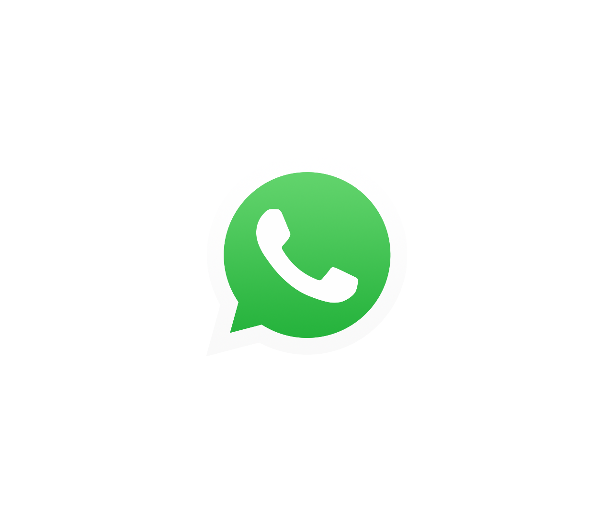
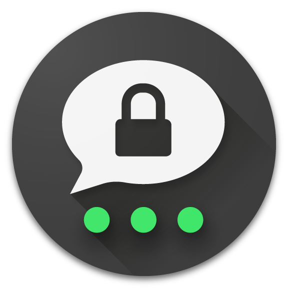
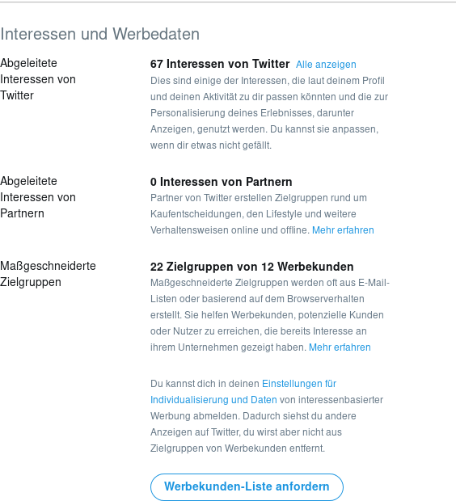
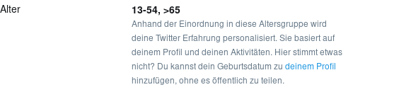
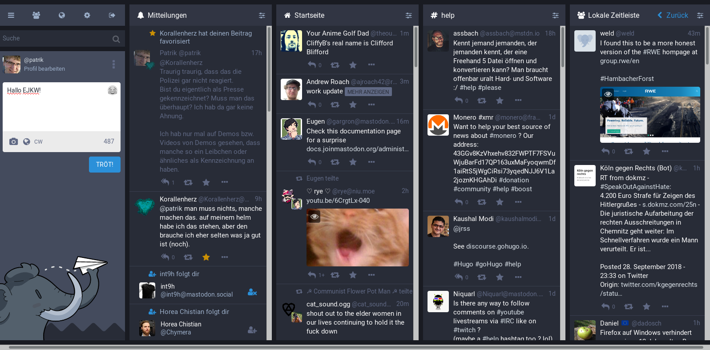

---

title: Alternativen zu Google & Co
subtitle: Das Was, Wie und Warum
author: Patrik Tesarik
date: 29.09.18

---

## Alternativen zu Google & Co
### Ein Versuch des Datenschutzes
[Patrik Tesarik](https://social.tchncs.de/@patrik)

<small> 30. September 2018 @ JuBi Tecklenburg 
</small>

---

# Was wird eigentlich benutzt?

---

### Chatsysteme

* WhatsApp
* Telegram

---

### Social Media

* Facebook
* Twitter
* Instagram
* Youtube, kind of

---

### Webservices & Cloud

* Dropbox
* Doodle
* TinyUrl
* Google
  * Office (Docs, Sheets, Presentations)
  * Calendar & Contacts

---

## Chatsysteme 

---

## WhatsApp 

* Facebook-Tochter seit 2014
* Austausch von Daten
  * Eindeutige Kennziffern
  * Metadaten (Nutzungsstatistik)
  * Kontaktabgleich 

---

## Telegram 

> Sichere Kommunikation darf nichts kosten

* Russisches Programmierteam @ Dubai
* Eigenes Kryptoprotokoll
* Standard: Keine Krypto
* Kontaktabgleich & Auswertung

---

## Chatsysteme
### Alternativen

---

## Threema 

* Geprüftes Kryptoprotokoll
* Verschlüsselung Ende-zu-Ende als Standard
* Minimale Metadaten & Nutzungsstatistik
* Closed Source (!)

---

## Signal 

* Etabliertes [Kryptoprotokoll](https://de.wikipedia.org/wiki/Signal_Protokoll)
* Verschlüsselung Ende-zu-Ende als Standard
* Minimale Metadaten & Nutzungsstatistik
* [Open Source](https://github.com/signalapp), aber...
* ... Servermonopol (keine Dezentralisierung)

---

## Conversations / XMPP  

* Identisches [Kryptoverfahren](https://conversations.im/omemo) wie Signal
* AGB abh. von Serverbetreiber
* Dezentral & [Standardisiert](https://xmpp.org)
* Open Source

---

## Social Media

---

## Facebook 

* [Werbung!](https://www.Facebook.com/about/ads)
* [Analyse](https://www.facebook.com/privacy/explanation)
* [Kekse](https://www.facebook.com/policies/cookies)
* Dürfen die das? 
* [Na klar!](https://www.facebook.com/legal/terms)

---

## Twitter 

* Werbung, nicht zu knapp.
* Analyse
* Intransparente Löschmechanismen

---

---

---

## Alternativen
## Social Media 1/2

---

## Hubzilla

* Dezentral
* Federated
* [Open Source](https://framagit.org/hubzilla/core)
* [Neugierige](https://project.hubzilla.org) vor!

---

## Mastodon 

* Dezentral & Federated
* AGB je nach Anbieter
* Open Source
* [Probiert's](https://joinmastodon.org) aus

---

---

## Instagram  

* Facebook-Tochter
* s. Facebook
* s. WhatsApp

---

## Youtube

* s. Google

---

## Alternativen
## Social Media 2/2

---

* [Pixelfed W.I.P](https://Pixelfed.org)
* [Peertube](htts://peertube.social)
* [Vimeo](https://vimeo.de), kind of

---

### Webservices & Cloud

* flickr  -> [mediagoblin.org](https://mediagoblin.org)
* Dropbox -> [Nextcloud](https://Nextcloud.org)
* Doodle  -> [dudle.de](https://dudle.inf.tu-dresden.de)
* TinyUrl -> [t1p.de](https://t1p.de)
* Google  -> [Nextcloud](https://cloud.ev-kirche-milspe-rueggeberg.de0),[Cryptpad](https://cryptpad.fr)
  * Office (Docs, Sheets, Presentations)
  * Calendar & Contacts

---

## Kontakt 

* [XMPP](xmpp://depate@trashserver.net) 
* [Mastodon](https://social.tchncs.de/@patrik)
* [Mail](mailto:patrik@fam-goedecke.de) / [E680ACBF](https://pgp.mit.edu/pks/lookup?op=get&search=0x93992161E680ACBF)
